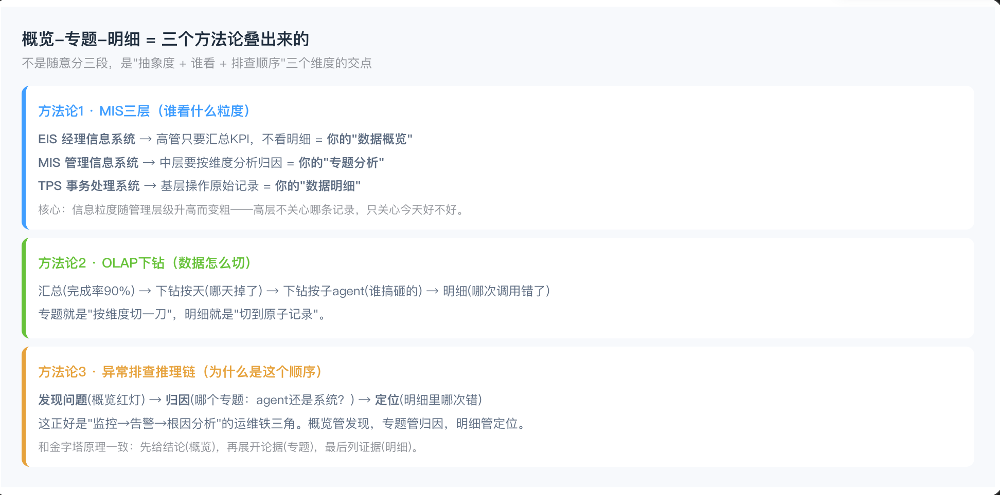

# 概览-专题-明细（Overview–Topic–Detail）

> 为什么「概览-专题-明细」是数据呈现的标准答案：它是抽象度 × 受众 × 排障顺序的交集。

## 方法一：MIS 三层（受众 × 粒度）

| 层 | 系统 | 谁看 | 对应 |
|---|---|---|---|
| 概览 | EIS | 高管要 KPI 总况，不要明细 | 数据概览 |
| 专题 | MIS | 中层要按维度分析找原因 | 专题分析 |
| 明细 | TPS | 一线处理原始业务记录 | 数据明细 |

**核心：** 管理层级越高，信息粒度越粗；高层只关心「整体好不好」，不关心单条记录。

## 方法二：OLAP 下钻（数据怎么切）

总况（如完成率 90%）→ 按天下钻（哪天掉的）→ 按子代理下钻（谁挂的）→ 明细（哪通失败）。

- **专题** = 按维度切片  
- **明细** = 切到原子记录

## 方法三：异常排障推理链（顺序）

发现（概览红灯）→ 归因（哪个专题：坐席还是系统）→ 定位（明细哪条错误）。

对齐运维铁三角：监控 → 告警 → 根因；也对齐金字塔原理：结论（概览）→ 论据（专题）→ 证据（明细）。

## 一句话

概览负责发现，专题负责归因，明细负责定位。
